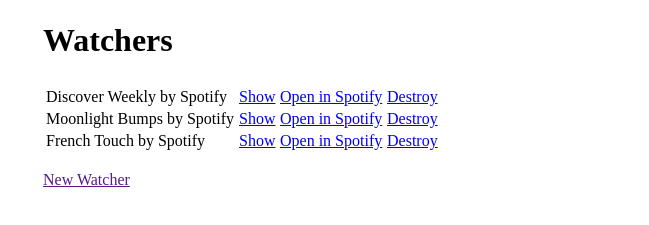

# README

Freeze Spotify playlists for posterity

[Heroku app](https://kessel-coldrage.herokuapp.com/). Don't break the dyno!

||||
|--|--|--|
| |  | |
||||

## Setup

1. Install direnv
1. `cp envrc.example .envrc`
1. Add your Spotify Client ID and secret to the .envrc file
1. Run `direnv allow`
1. Install libpq-dev
1. Install [yarn](https://yarnpkg.com/) and run `yarn install`
1. Create a Postgres user (https://www.postgresql.org/docs/12/app-createuser.html)
    `sudo -u postgres createuser $USER --createdb --login`
1. Run `bin/rails db:create` and `bin/rails db:prepare`
1. Start `bin/webpack-dev-server
1. In a new prompt run `bin/rails s` and navigate tolocalhost:3000
